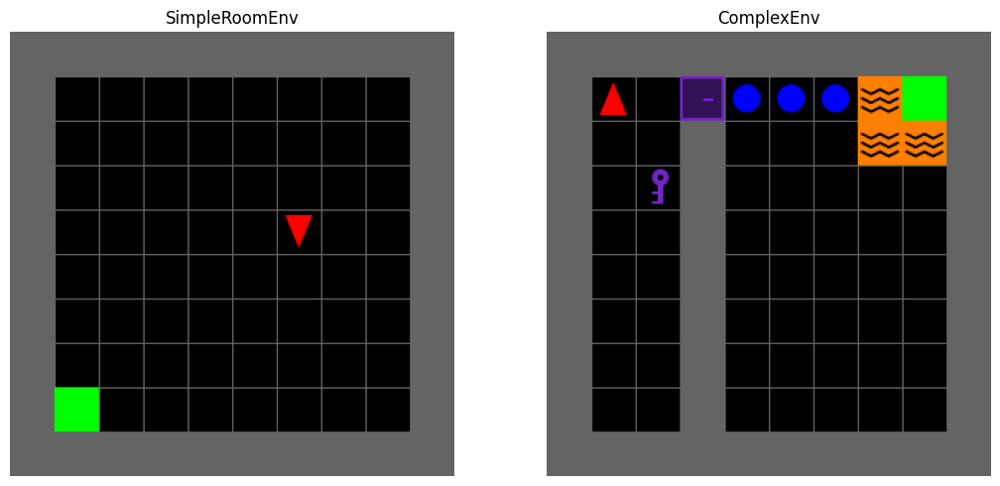
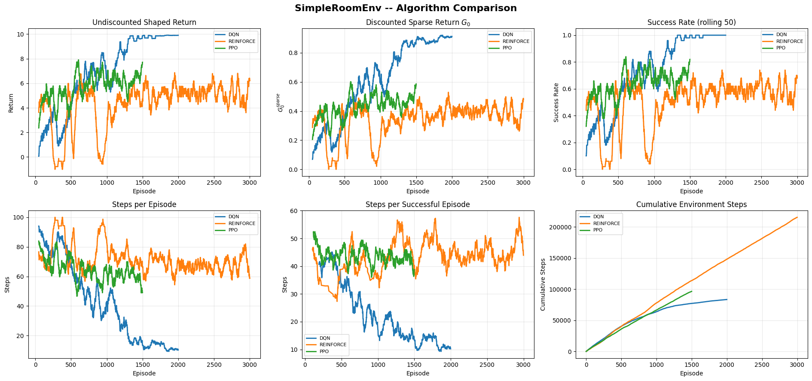
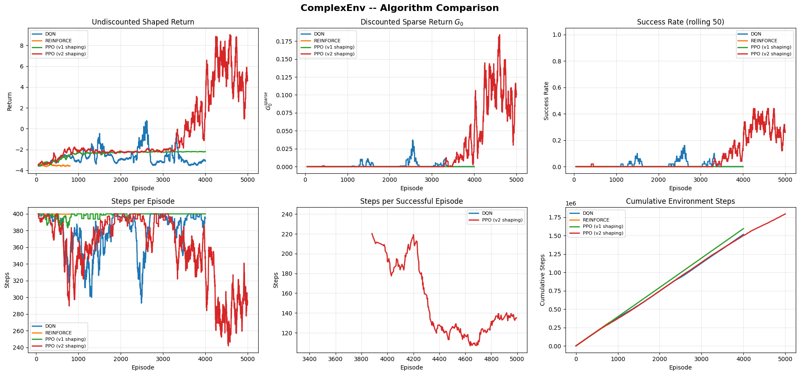
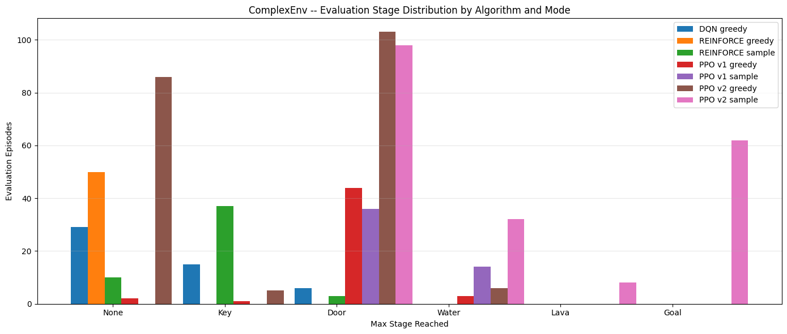
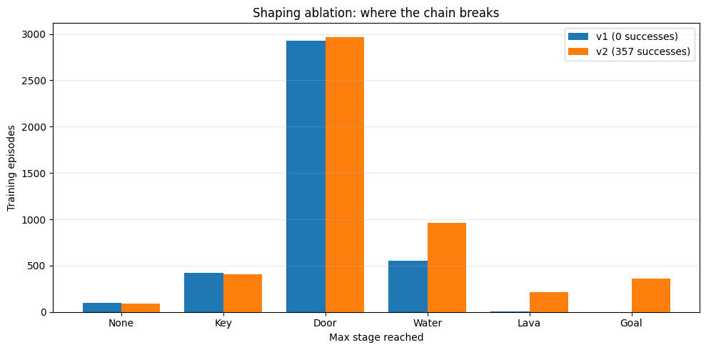
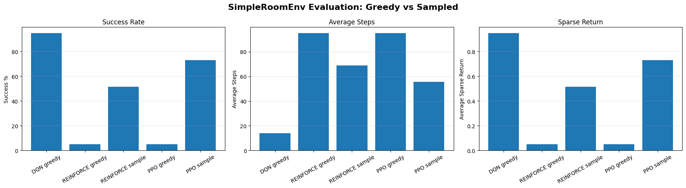
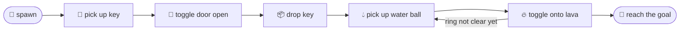
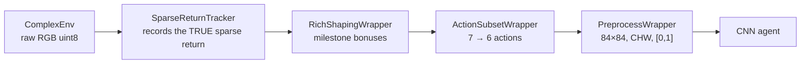

<div align="center">

# 🕹️ Deep RL in MiniGrid — from pixels, from scratch

**Three agents, one from each algorithm family, implemented from scratch in PyTorch and trained on raw rendered pixels.**
No symbolic state. No privileged getters. No RL libraries for the algorithms themselves.

[](https://www.python.org/)
[](https://pytorch.org/)
[](https://gymnasium.farama.org/)
[](https://minigrid.farama.org/)
[](https://colab.research.google.com/github/TalHibner/reinforcement-learning-final/blob/main/2026B_FinalProjectFinal.ipynb)



*Left: the sanity environment. Right: the task — key 🔑, locked door 🚪, water balls 🔵, lava ring 🔥, goal 🟩.*

</div>

---

## 🎯 What this is

Final project for **Deep Reinforcement Learning (2026 B)**. The agents see only the rendered
RGB image of the grid and must learn to act from it.

| | |
|---|---|
| 📓 **Deliverable** | [`2026B_FinalProjectFinal.ipynb`](2026B_FinalProjectFinal.ipynb) — run top-to-bottom, outputs included |
| 📄 **Report** | [`report_026548446.pdf`](report_026548446.pdf) — the primary deliverable, self-contained |
| 🧠 **Algorithms** | DQN (value-based) · REINFORCE (policy-based) · PPO-Clip (actor–critic) |
| 👁️ **Observation** | raw pixels → 84×84, grayscale on the simple env, RGB on the complex one |
| ⚙️ **Trained on** | a single Colab T4, ~3.4M environment steps total |

---

## 📊 Results at a glance

| Agent | Environment | Success rate |
|---|---|---|
| 🥇 **DQN** (greedy) | SimpleRoomEnv | `███████████████████░` **95.0 %** |
| 🥈 **PPO** (sampled) | SimpleRoomEnv | `███████████████░░░░░` **73.0 %** |
| 🏅 **PPO v2** (sampled) | **ComplexEnv** | `██████░░░░░░░░░░░░░░` **31.0 %** |

PPO with corrected reward shaping completes the whole five-stage chain — key, door, water
ferry, lava extinguished, goal — in **31 % of unseen layouts, from pixels alone**. Every
other agent reaches 0 %.

### 🟩 SimpleRoomEnv — 200 held-out episodes

| Algorithm | Mode | Success % | Avg sparse | Avg $G_0$ sparse | Avg shaped | Avg steps |
|---|---:|---:|---:|---:|---:|---:|
| **DQN** | greedy | **95.0** | +0.950 | +0.8726 | +9.36 | **14.1** |
| REINFORCE | greedy | 5.0 | +0.050 | +0.0486 | −0.45 | 95.2 |
| REINFORCE | sample | 51.5 | +0.515 | +0.3645 | +4.46 | 68.8 |
| PPO | greedy | 5.0 | +0.050 | +0.0486 | −0.45 | 95.2 |
| PPO | sample | 73.0 | +0.730 | +0.5135 | +6.74 | 55.6 |



*DQN converges to a near-optimal 14-step path; the policy-gradient agents plateau around 60 %
under their behaviour policy.*

### 🧩 ComplexEnv — held-out layouts

*(n = 200 for PPO v2, n = 50 for the other rows)*

| Algorithm | Mode | Success % | Avg shaped | Mean stage | Median stage | Max stage | Lava death % | Avg ext. |
|---|---:|---:|---:|---:|---:|---:|---:|---:|
| DQN | greedy | 0.0 | −3.65 | 0.54 | 0.0 | 2 (Door) | 0.0 | 0.00 |
| REINFORCE | greedy | 0.0 | −4.00 | 0.00 | 0.0 | 0 (None) | 0.0 | 0.00 |
| REINFORCE | sample | 0.0 | −3.54 | 0.86 | 1.0 | 2 (Door) | 0.0 | 0.00 |
| PPO v1 | greedy | 0.0 | −2.34 | 1.96 | 2.0 | 3 (Water) | 0.0 | 0.00 |
| PPO v1 | sample | 0.0 | −2.20 | 2.28 | 2.0 | 3 (Water) | 0.0 | 0.00 |
| PPO v2 | greedy | 0.0 | −3.06 | 1.15 | 2.0 | 3 (Water) | 0.0 | 0.00 |
| 🏅 **PPO v2** | **sample** | **31.0** | **+5.54** | **3.17** | **3.0** | **5 (Goal)** | 6.0 | 0.38 |



*The red curve is PPO v2. Nothing moves for 3,500 episodes — then the sparse return, the
success rate and the path length all break together around episode 4,000.*



*How far each agent gets. Only PPO v2 sampled (pink) has mass on **Goal**.*

`Avg ext.` is the mean number of lava tiles extinguished per episode. At these counts a
single episode is 0.5–2 percentage points, so isolated events are anecdotes, not rates — the
report treats them that way.

---

## 🔬 Three findings the numbers alone don't show

### 1️⃣ A two-constant change to the reward shaping decided the project

`lava_bonus 0.5 → 1.5` and `death_penalty 2.0 → 1.0`. Nothing else. PPO went from **0
successes in 4,000 episodes to 357 in 5,000**.



Global reward-budget safety (total shaping mass < discounted goal payoff) and local
risk–reward balance are **independent constraints** — satisfying only the first is not
enough. Under v1 the agent reached Water and stopped: approaching lava carried more expected
penalty than the extinguish bonus was worth. The notebook ships both the budget audit
(`audit_shaping_mass`) that checks the first constraint and the ablation that found the
second.

### 2️⃣ Comparable scores, categorically different mechanisms

Measured against a fixed policy sampling from each agent's *own* action frequencies:
**88 % of DQN's** SimpleRoomEnv performance comes from conditioning on the observation, while
**93 % of PPO's** comes from a state-independent action prior. Two agents "solving" an
environment can be doing entirely different things.

### 3️⃣ Greedy evaluation understates both families

| Agent | Deterministic | With stochasticity |
|---|---:|---:|
| DQN (mean stage) | 0.54 at ε=0 | **1.60** at ε=0.05 |
| PPO v2 (mean stage) | 1.15 argmax | **3.17** sampled |
| PPO v2 (success) | 0 % argmax | **31 %** sampled |

Reported greedy *and* sampled everywhere, rather than picking the flattering one.



---

## 🗺️ The environments

Both are fixed by the assignment — only `max_steps` may be overridden; everything else is
done with wrappers.

| Environment | Layout | Win condition | Horizon |
|---|---|---|---|
| 🟩 `SimpleRoomEnv` | empty 10×10 room | step onto the green goal | 100 steps |
| 🧩 `ComplexEnv` | two rooms, locked door, water balls, lava ring | the chain below | 400 steps |



Only one object can be carried at a time, which is why the key must be dropped before water
can be picked up. Stepping on un-extinguished lava is lethal. Observations are raw full-grid
RGB (`uint8`, `H·tile × W·tile × 3`); the action space is MiniGrid's standard `Discrete(7)`,
narrowed by wrapper to 3 actions on the simple env and 6 on the complex one.

---

## 🧠 What's implemented

### Agents — from scratch, PyTorch only for the networks

| | Highlights |
|---|---|
| 🎯 **DQN** | target network, replay buffer, ε-greedy schedule, and truncation handled correctly in the Bellman target — a time limit is not a terminal state |
| 🎲 **REINFORCE** | Monte-Carlo returns with a running-mean baseline, entropy regularisation on the same scale as the policy term, a documented early-stop rule, plus a controlled ablation of the baseline choice |
| ⚖️ **PPO-Clip** | GAE(λ), shuffled minibatches, LR annealing, KL early-stop checked *before* the optimiser step, and bootstrapping through time-limit truncation instead of treating it as episode end |

All three share a Nature-DQN style CNN (3 conv layers → 512-unit FC head).

### The wrapper stack



`SparseReturnTracker` sits **innermost**, so the true sparse return is captured before any
shaping touches it and can be reported alongside the shaped one — everywhere, without
cosmetics.

### Training infrastructure

- 🏆 **One model-selection rule** applied identically to all three algorithms
  (`BestCheckpointer`: rolling success rate, tie-broken by mean stage then mean shaped return).
- 🔍 **Periodic greedy probes** (ε=0), so training curves and evaluation measure the same policy.
- 🎲 **Per-episode deterministic seeding** with disjoint train / eval / video / probe seed spaces.
- 🎬 **Mid-training and converged rollout videos** embedded in the notebook.
- 💾 **Colab autosave + resume** (below).

---

## ▶️ Running it

### On Colab (as submitted)

[](https://colab.research.google.com/github/TalHibner/reinforcement-learning-final/blob/main/2026B_FinalProjectFinal.ipynb)

Set the runtime to a **T4 GPU** and Run All. The first cell installs anything missing and
mounts Drive if available; `STORAGE_ROOT` resolves to mounted Drive → Colab session storage →
a local folder, so the notebook also runs off-Colab unchanged.

```
artifacts/
├── logs/         <run>.json           per-episode training curves
├── checkpoints/  <run>_best.pt        best-so-far weights (what results are evaluated on)
│                 <run>_latest.pt      current weights + step counter (for resuming)
│                 <run>_final.pt       end-of-run weights
└── plots/        <run>_*.png          every saved figure
```

### ⚡ Skip training entirely

Full training is several GPU-hours. The **Reload from Checkpoints** cell rebuilds all six
agents and loggers from saved artifacts:

```python
LOAD_FROM_ARTIFACTS = True     # then Run All
```

Every figure, table and video regenerates from stored state in minutes. Which weights get
loaded is stated explicitly — `prefer_best=True` uses the same best-so-far rule as the
reported results.

### 💾 Surviving a disconnect

Free-tier sessions drop mid-cell and the ComplexEnv runs are multi-hour, so every training
loop autosaves its curve and its current weights — plus `agent.steps`, which the ε schedule
and target sync depend on — **every 250 episodes**. A disconnect costs at most 250 episodes
of curve data. The **Recovery** section reports what is recoverable and can resume DQN
training where it stopped, continuing the episode-seed sequence and splicing the logs so the
cumulative-steps axis stays exact:

```python
RESUME_RUN = "dqn_complex"     # None = just print the recovery status table
```

On-policy runs (REINFORCE, PPO) restart rather than splice — the caveats are documented in
the notebook and the report.

### 📦 Requirements

`gymnasium` · `minigrid` · `torch` · `numpy` · `matplotlib` · `opencv-python` · `imageio` +
`imageio[ffmpeg]` · `ipywidgets` · `pyvirtualdisplay` on headless Linux.
The install cell is idempotent — it only pip-installs what isn't already importable.

---

## 🎛️ Settings

<details>
<summary><b>Best training settings (click to expand)</b></summary>

| Run | Episodes | Key hyperparameters |
|---|---:|---|
| `dqn_simple` | 2,000 | lr 1e-4 · γ 0.99 · ε 1.0→0.05 over 60k steps · buffer 30k · batch 64 · target sync 500 · train_freq 4 |
| `reinforce_simple` | 3,000 | lr 3e-4 · γ 0.99 · entropy 0.01 · running-mean baseline |
| `ppo_simple` | 1,500 | lr 2.5e-4 · γ 0.99 · λ 0.95 · clip 0.2 · entropy 0.01 · 4 epochs × 4 minibatches · n_steps 256 · target KL 0.015 · LR anneal |
| `dqn_complex` | 4,000 | lr 1e-4 · γ 0.99 · ε 1.0→0.15 over 600k steps · buffer 100k · batch 64 · target sync 1000 · train_freq 4 |
| `reinforce_complex` | 4,000 (early-stopped at 801) | lr 3e-4 · γ 0.99 · entropy 0.02 · running-mean baseline |
| `ppo_complex` | 4,000 (v1) / 5,000 (v2) | lr 2.5e-4 · γ 0.99 · λ 0.95 · clip 0.2 · entropy 0.015 · 4 epochs × 4 minibatches · n_steps 1024 · target KL 0.015 · LR anneal |

**ComplexEnv shaping (v1 → v2):** `goal_scale 20.0` · `key 0.5` · `door 1.0` ·
`right_room 0.25` · `water 0.2` · **`lava 0.5 → 1.5`** · `step_penalty 0.01` ·
**`death_penalty 2.0 → 1.0`** · `water_mode first` · `drop_water_penalty 0.2`

**Inference:** greedy argmax; sampled mode reported alongside. 200 eval episodes on
SimpleRoomEnv, 50–200 on ComplexEnv, on a fresh seed space disjoint from training.

</details>

<details>
<summary><b>Training budgets actually used on ComplexEnv</b></summary>

| Algorithm | Episodes | Env steps | Mean steps/ep |
|---|---:|---:|---:|
| DQN | 4,000 | 1,515,986 | 379 |
| REINFORCE | 801 (early stop) | 320,400 | 400 |
| PPO | 4,000 | 1,593,664 | 398 |

PPO v2 extends to 5,000 episodes (~1.79M steps) — a deliberate budget extension to let the
breakthrough converge.

</details>

---

## 🔁 Reproducibility

Master seed **42** throughout. `set_seed` covers Python / NumPy / torch (+ cuDNN
deterministic) at the top of every run; each episode resets with
`episode_seed(42, episode_idx, phase)`, where the phases occupy disjoint ranges —
train `+0`, eval `+10M`, video `+20M`, probe `+30M`, eval-torch `+40M` — so **evaluation
layouts are never training layouts**. Sampled-mode evaluation reseeds the torch RNG per
episode, so even the stochastic results reproduce. Every hyperparameter is stated explicitly
in the dedicated **Best Settings** cell; nothing is left to a default.

---

## 📁 Repository layout

```
📓 2026B_FinalProjectFinal.ipynb   the submitted notebook (all outputs included)
📄 report_026548446.pdf            the report — primary deliverable
🖼️ report_images/                  figures used in the report
📋 Assignment3.md / .pdf           the assignment specification
🕹️ env_explorer.py                 button-driven inline MiniGrid explorer
🗂️ drafts/                         earlier experiment notebooks, kept for provenance
```

`env_explorer.py` is a standalone debugging aid: it renders any MiniGrid env inline with
buttons, auto-discovers the env's state getters, and shows shaped reward per action — used
while designing the wrappers, not part of the training pipeline.

---

## 👤 Author

**Tal Hibner** — ID 026548446

Coursework submitted for Deep Reinforcement Learning (2026 B). Published for reference — if
you are taking this course, read your institution's academic-integrity policy before looking
further. 🎓
